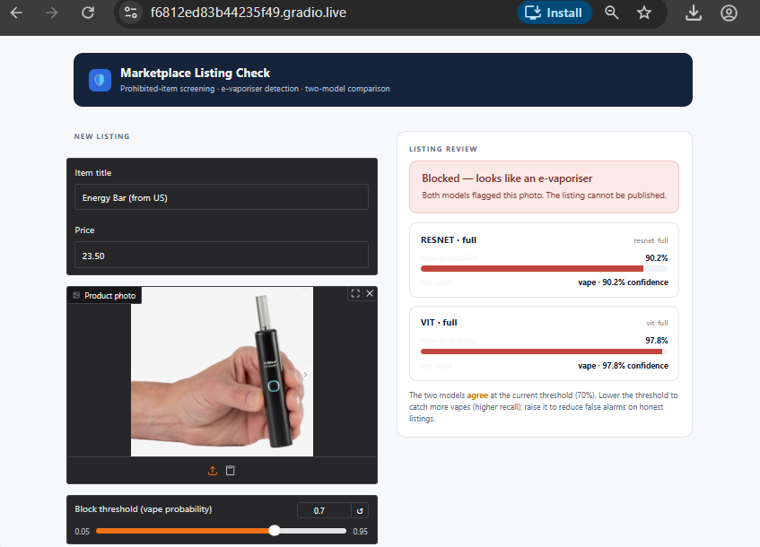
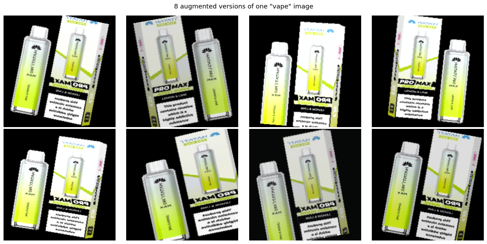
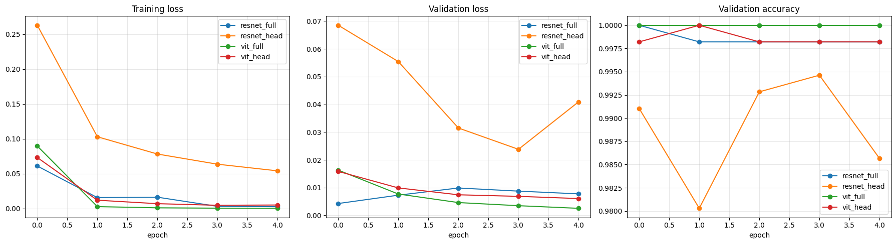
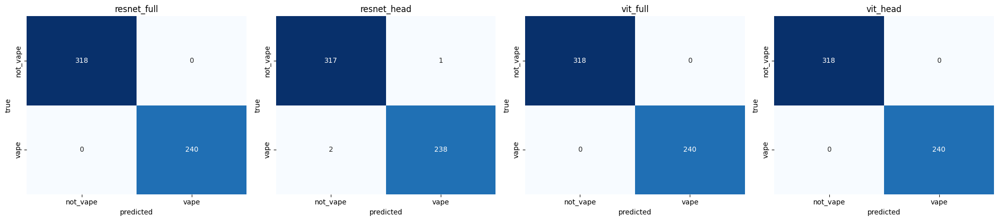

# 🛡️ E-Vaporiser Image Classifier
### Automated photo screening for e-vaporiser (vape) listings on online marketplaces

*Transfer learning · Data augmentation · ResNet vs ViT · Weights & Biases · Gradio seller-portal demo*

---

## Preview — the seller-portal demo

  

Gradio seller-portal interface built in Step 12 of the notebook; upload your own photo to see live results.

---

## Description & Background

Online classified-ad marketplaces need to keep prohibited items — including **e-vaporisers (vapes)** — off their listings. Today that mostly relies on user reports or moderators scrolling through photos, which is slow and inconsistent.

This project builds the model behind an automated fix: the moment a seller uploads a listing photo, a binary image classifier decides **"is this a vape, yes or no?"** — and the listing is allowed, sent for human review, or blocked, automatically.

The project is a single, self-contained Colab notebook that:

1. Sources a real, labelled image dataset (positive vape photos, everyday-object negatives, and hard-negative look-alikes),
2. Trains and compares multiple transfer-learning configurations,
3. Evaluates them properly on a held-out test set, and
4. Ships a working demo of the two best configurations — a seller-portal-style web app — all inside the same notebook session.

---

## ML Concepts Employed

- **Transfer learning** — reusing ImageNet-pretrained backbones instead of training from scratch
- **Fine-tuning strategies** — full fine-tune (all layers trainable) vs head-only (frozen backbone, feature-extractor style)
- **Convolutional Neural Networks (CNNs)** vs **Vision Transformers (ViTs)** — architecture comparison
- **Binary image classification** with a modified classifier head (1000-class → 2-class)
- **Data augmentation** — random crop/zoom, flip, rotation, colour jitter — applied to training data only
- **Hard-negative mining** — deliberately including look-alike objects (lighter, USB drive, power bank) in the negative class to make the model more discriminating
- **Stratified train / validation / test splitting** to keep class balance consistent and evaluation honest
- **Model evaluation** — accuracy, precision, recall, F1, and confusion matrices, with a focus on **vape recall** (the metric that matters most for a moderation tool)
- **Experiment tracking** — comparing multiple training runs quantitatively rather than by eye

---

## Technologies Used

**Models**

- `ResNet18` — via `torchvision.models` (CNN backbone)
- `ViT-Base/16` (`google/vit-base-patch16-224`) — via Hugging Face `transformers` (Transformer backbone)

**Datasets**

- **Roboflow Universe** — positive vape photos, and hard-negative look-alikes (lighter, USB drive, power bank)
- **Imagenette** (fast.ai) — easy-negative everyday-object photos, downloaded from a public URL, no login required

**Frameworks & Libraries**

- `PyTorch` / `torchvision` — model backbone + training loop
- `transformers` (Hugging Face) — ViT backbone
- `scikit-learn` — accuracy / precision / recall / F1 / confusion matrix
- `matplotlib`, `seaborn` — plots and heatmaps

**Experiment Tracking**

- **[Weights & Biases](https://wandb.ai)** — logs loss/accuracy for every training run to a shared online dashboard for side-by-side comparison

**Environment & Demo**

- **Google Colab** — GPU runtime, no local setup required
- **Gradio** — the seller-portal demo web app, launched directly from the notebook

---

## Results Snapshot

  
   Step 5 — visual check of the augmentation pipeline (random crop, flip, rotation, colour jitter)

  
   Step 9 — training/validation curves across all four backbone × strategy configurations

  
   Step 10 — test-set confusion matrices; the bottom-left cell (missed vapes) matters most for a moderation tool

> **Note:** these three images are real output from an earlier full run of the pipeline, kept here as a representative illustration. Because the exact Roboflow projects and dataset sizes are configurable, your own run's numbers, and the images above, will differ.

---

## Instructions to Use

1. **Open the notebook in Google Colab** and set a GPU runtime (*Runtime → Change runtime type → GPU*).
2. **Run Step 0** to install dependencies.
3. **Get a free [Roboflow](https://roboflow.com) API key** and paste it into the Step 3 config cell.
4. **Fill in the four Roboflow sources** in the same config cell:
    - `RF_VAPE` — already set to a working public project (`vape-dataset/vape-dataset`)
    - `RF_HARD_NEGATIVES` — search [Roboflow Universe](https://universe.roboflow.com) for `lighter`, `usb flash drive`, and `power bank`, and paste in a workspace/project/version for each
5. *(Optional)* **Get a free [wandb.ai](https://wandb.ai) API key** for Step 2 to log training runs online. Set `USE_WANDB = False` to skip this.
6. **Run the rest of the notebook top to bottom.** Step 8 trains all four configurations; Step 12 launches the live seller-portal demo with the two best ones.
7. **Try the demo** — upload a photo, watch the two models score it, and drag the threshold slider to see the allow/review/block trade-off.

### Things to Note

- **No exact "USB drive" / "power bank" dataset exists** in most open collections — you're choosing the closest real Roboflow project available, so hard-negative quality depends on what you pick.
- **Training time** — full fine-tuning (especially the ViT) is the slowest part; head-only runs are fast. Reduce `EPOCHS` for a quicker pass, increase it for stronger results.
- **The demo is session-only** — nothing is saved to disk or Google Drive; closing the Colab runtime ends the demo. Re-run Steps 8–12 to relaunch it.
- **Class balance is a target, not a guarantee** — check the printed counts at the end of Step 3 to see what was actually collected before trusting the results.
- **Decision threshold** — the demo defaults to 0.5. A real moderation policy would likely tune this toward catching more vapes (higher recall), accepting a few false positives for a human to clear.

---

Built with PyTorch, Hugging Face Transformers, Roboflow, Weights & Biases, and Gradio — all inside a single Google Colab notebook.

